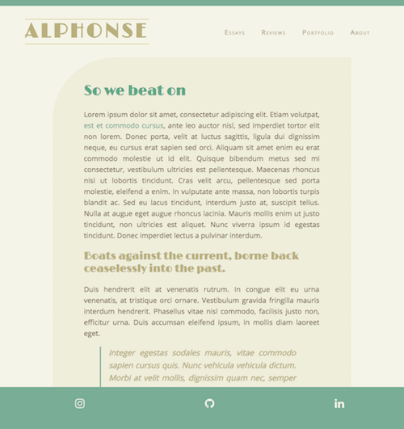

# Welcome to Alphonse

Alphonse is a simple, beautiful responsive template written with HTML, CSS, and vanilla JS. 

You're free to use it in any project.

Here's what it looks like:

[Check out the live demo](https://affectionate-panini-725823.netlify.com/)

## Goals of the projects

- Mobile-first
- Content focused
- Quick loading time

## License

MIT
